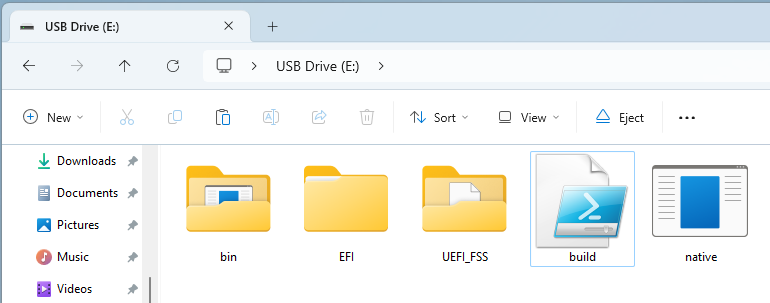
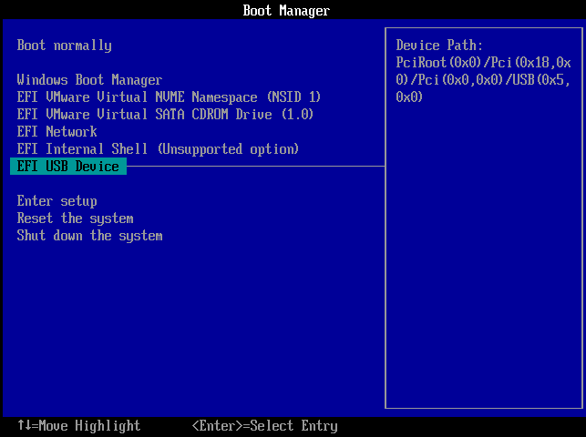
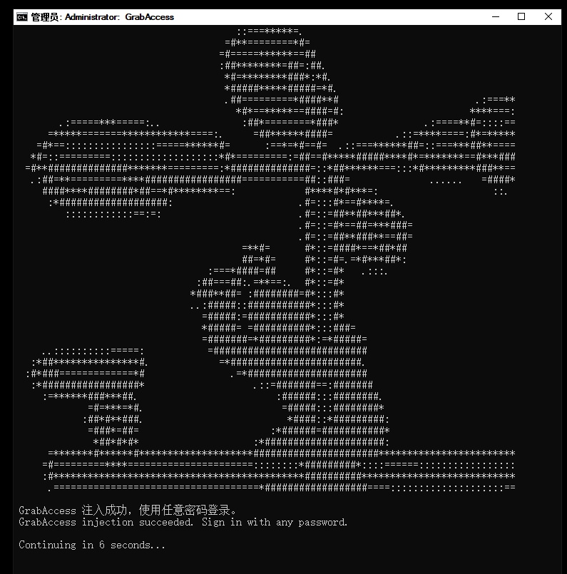
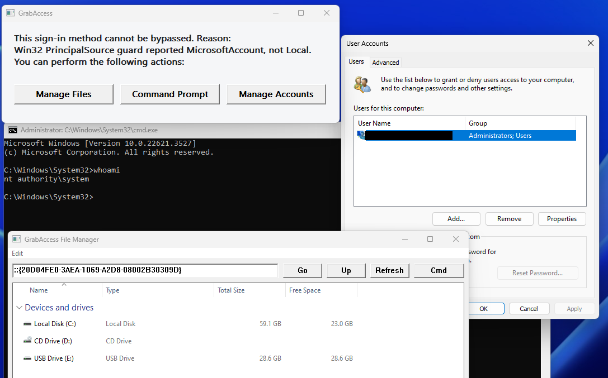
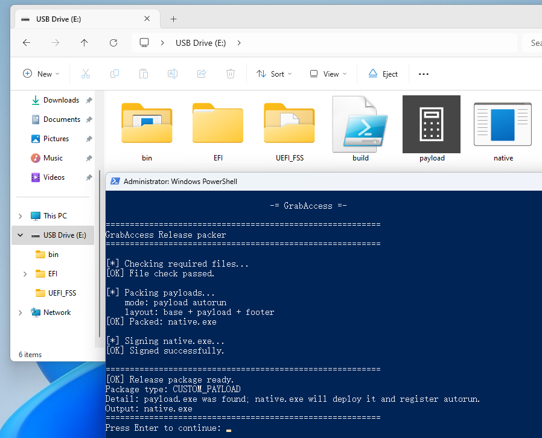
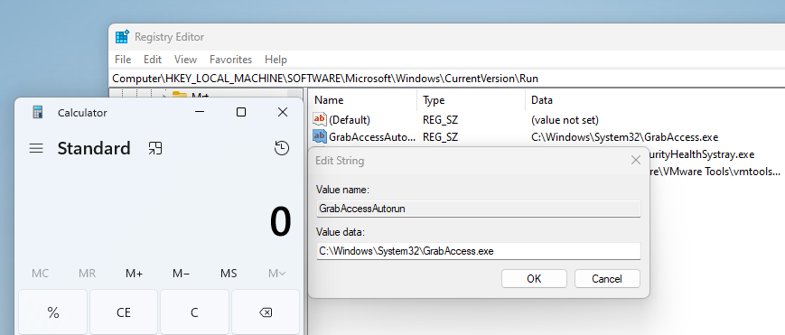
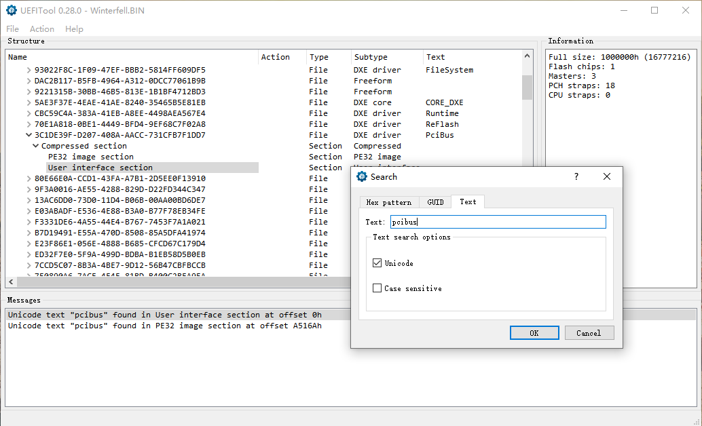
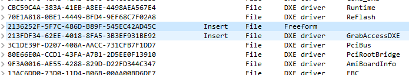
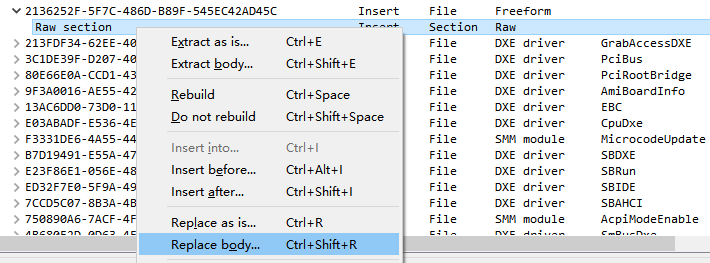

# GrabAccess

**Bootkit / Windows Login Password Bypass Tool**

------

[**English**](https://github.com/Push3AX/GrabAccess/blob/main/readme.md) | [中文](https://github.com/Push3AX/GrabAccess/blob/main/readme_cn.md)

With physical access to the target device, GrabAccess can:

1. Bypass supported Windows local-account sign-in paths (local account + password / PIN / picture password)
2. Provide file management and account management without signing in when the current sign-in method cannot be bypassed
3. Automatically implant a specified program and add it to startup
4. Survive operating system reinstallations or hard drive replacement by modifying the motherboard UEFI firmware (Bootkit)

However, GrabAccess does not support bypassing Secure Boot, MBR boot, or 32-bit operating systems.

------

## Quick Start

The basic function of GrabAccess is to bypass the Windows login password.

1. Prepare a USB drive formatted in either `FAT16` or `FAT32`.

2. Download [GrabAccess_Release.zip](https://github.com/Push3AX/GrabAccess/releases/download/Version1.2/GrabAccess_Release_1.2.0.zip) and extract it to the root directory of the USB drive.

3. Plug the USB drive into the target computer. Reboot and enter the BIOS menu upon startup. Select the USB drive as the boot option. If `Secure Boot` is enabled, disable it first.

4. If the sign-in authentication bypass succeeds, a prompt will appear during startup. Later, at the Windows sign-in screen, enter any password to sign in.

5. If the sign-in method cannot be bypassed, a helper window will appear during startup. You can manage files, manage accounts, or execute commands with System privileges.

------

## Automated Implantation

GrabAccess can automatically implant a specified program and add it to the startup items.

For this feature, you need to bundle GrabAccess with the program you wish to implant:

1. Download [GrabAccess_Release.zip](https://github.com/Push3AX/GrabAccess/releases/download/Version1.2/GrabAccess_Release_1.2.0.zip) and extract it to the root directory of the USB drive.

2. Name the program you wish to implant as `payload.exe` and place it in the root directory of the USB drive.

3. Run `powershell -ExecutionPolicy Bypass -File .\build.ps1` to bundle everything together.

4. Plug the USB drive into the target computer and boot from the USB drive.

5. Once Windows boots, the specified program will be added to startup and executed.

------

## Implementing Bootkit via Motherboard UEFI Firmware Modification

GrabAccess can be integrated into a computer's motherboard UEFI firmware, ensuring hardware-level persistence (Bootkit).

Each time Windows boots, GrabAccess re-implants the specified program. This process remains effective even after reinstallation of the operating system or replacement of the hard disk. Removal of this implant requires reflashing the motherboard's firmware or replacing the motherboard.

**Warning: The following procedure may damage your motherboard! Proceed only if you have sufficient knowledge of UEFI firmware. AT YOUR OWN RISK!!!!**

The process involves four main steps:

1. Bundle GrabAccess with the specified program
2. Extract the motherboard's UEFI firmware
3. Insert GrabAccessDXE into the UEFI firmware
4. Reflash the modified firmware back onto the motherboard

Steps 2 and 4 vary significantly across different motherboard models. While some can be flashed via software, others require a hardware programmer due to built-in verifications. Due to these variations, the specifics are not discussed here. It is advised to search online for the procedure relevant to your specific motherboard model.

To package GrabAccess with the intended program, follow the previously outlined steps: rename the program to `payload.exe`, place it in the GrabAccess root directory, and run `powershell -ExecutionPolicy Bypass -File .\build.ps1`. This results in a file named `native.exe`, which will be used in the subsequent steps.

After extracting the motherboard UEFI firmware, use [UEFITool](https://github.com/LongSoft/UEFITool) to open it. Press `Ctrl+F`, select `Text`, and search for `pcibus`. Double-click on the first result in the subsequent list.

Right-click on the `pcibus` entry and choose `Insert before`. Then select `GrabAccessDXE.ffs` from the `UEFI_FSS` folder in the downloaded [GrabAccess_Release.zip](https://github.com/Push3AX/GrabAccess/releases/download/Version1.2/GrabAccess_Release_1.2.0.zip).

After inserting `GrabAccessDXE`, right-click on it, choose `Insert before`, and add `native.ffs` from the `UEFI_FSS` folder. The list should appear as follows:

Open `native.ffs` (identified by its GUID `2136252F-5F7C-486D-B89F-545EC42AD45C`). Right-click on the `Raw section`, select `Replace body`, and replace it with the `native.exe` file that was previously created.

Lastly, save the modified firmware by selecting `Save image file` from the File menu.

This firmware is now embedded with a Bootkit and ready to be flashed back onto the motherboard. If done correctly, `native.exe` will be written and executed with each boot of Windows.

If the process fails, consider these steps:

1. Turn off `Secure Boot` and `CSM` in the UEFI settings, ensuring the OS boots in UEFI mode.
2. Insert `pcddxe.ffs` from the `UEFI_FSS` folder into the firmware as previously described. Note that this module may conflict with others, potentially preventing booting. This step is advised only if using a programmer!

------

## Going Deeper

### Windows Platform Binary Table

Unlike Kon-boot, which tampers with the Windows kernel, GrabAccess is based on a legitimate backdoor in Windows: WPBT (Windows Platform Binary Table).

Manufacturers typically use WPBT to integrate driver management and anti-theft software into their computers. Similar to a Bootkit virus, once a WPBT entry exists in the motherboard, the designated program will automatically be installed on Windows during boot-up, regardless of system reinstalls or hard drive changes.

WPBT was intended to be implemented by manufacturers into the UEFI firmware of the motherboard. However, attackers can exploit this mechanism by injecting a WPBT entry during the UEFI boot process, without needing to modify the motherboard firmware.

### What GrabAccess Does

GrabAccess consists of three stages.

Stage1 is a UEFI application or UEFI DXE driver. It writes a WPBT entry into the ACPI table in the UEFI environment. The USB version reads `native.exe` from the boot partition, writes the WPBT entry, and then continues to Windows Boot Manager. The firmware-implant version reads the embedded `native.exe` from the firmware volume, causing the WPBT flow to run again on every boot.

Stage2 is a Windows Native Application executed by WPBT before Windows sign-in. WPBT can only load a Native App, and the system has not yet entered the full Win32 environment at this stage. Stage2 reads the packaging information at the end of its own file and decides which mode to use.

In custom payload mode, Stage2 extracts the user-specified payload to `C:\Windows\System32\GrabAccess.exe`, and writes the `HKLM\SOFTWARE\Microsoft\Windows\CurrentVersion\Run\GrabAccessAutorun` startup item.

If there is no custom payload, Stage2 writes the Stage3 components `Injector.exe`, `GrabAccessMsvpBypass.dll`, `GrabAccessExplorerHost.exe`, and `GrabAccessFallback.exe` to `C:\Windows\System32`. It then hijacks LogonUI through IFEO so the GrabAccess helper script runs during startup.

When the sign-in method is local account + password / PIN / picture password, Stage2 uses `Injector.exe` to inject `GrabAccessMsvpBypass.dll` into `lsass.exe`. This DLL hooks `NtlmShared!MsvpPasswordValidate`, making the password validation function return success unconditionally. As a result, the user can sign in with any password.

When the sign-in method is a Microsoft account, Entra ID / Azure AD, a domain account, or a case that cannot be bypassed such as RunAsPPL / protected LSASS, Stage2 starts `GrabAccessFallback.exe`, which provides three entry points: file management, command prompt, and account management. The file manager is `GrabAccessExplorerHost.exe`, the command prompt entry opens `cmd.exe` with SYSTEM privileges, and the account management entry opens `netplwiz.exe`.

------

## Credits

1. [Windows Platform Binary Table (WPBT) ](https://download.microsoft.com/download/8/a/2/8a2fb72d-9b96-4e2d-a559-4a27cf905a80/windows-platform-binary-table.docx)
2. [WPBT-Builder ](https://github.com/tandasat/WPBT-Builder)
3. [Windows Native App by Fox](http://fox28813018.blogspot.com/2019/05/windows-platform-binary-table-wpbt-wpbt.html)
4. [Nefarius Injector](https://github.com/nefarius/Injector)

------

## 404Starlink

GrabAccess has joined [404Starlink](https://github.com/knownsec/404StarLink).
