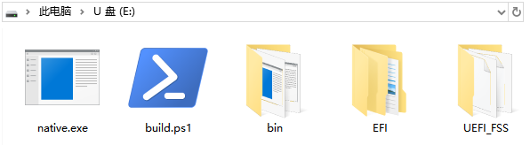
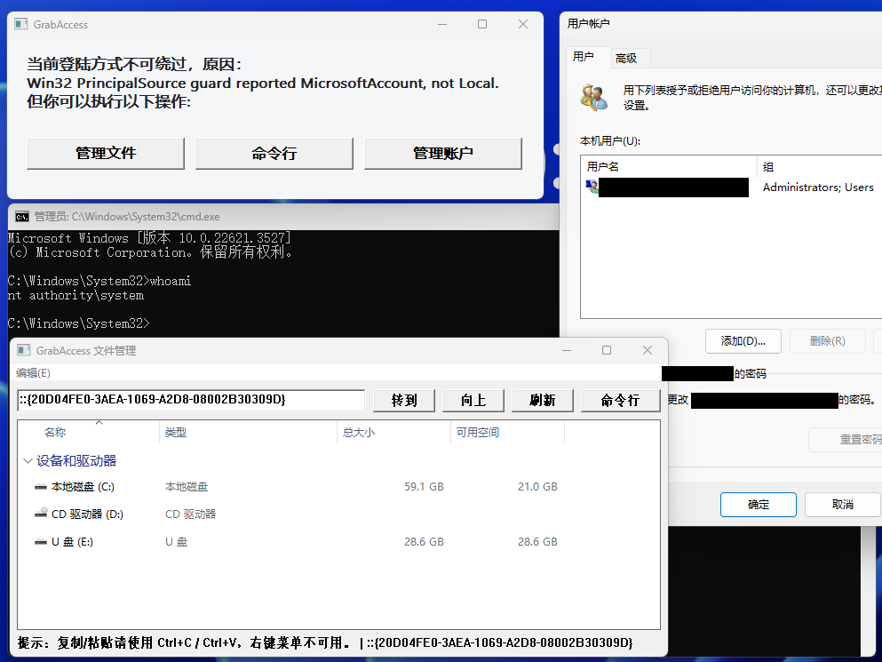
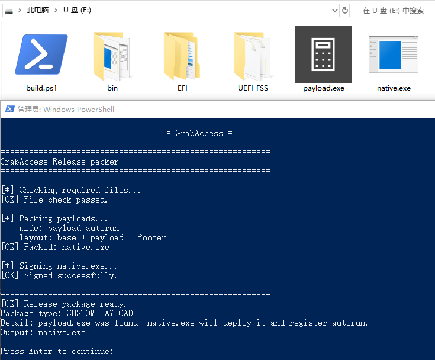
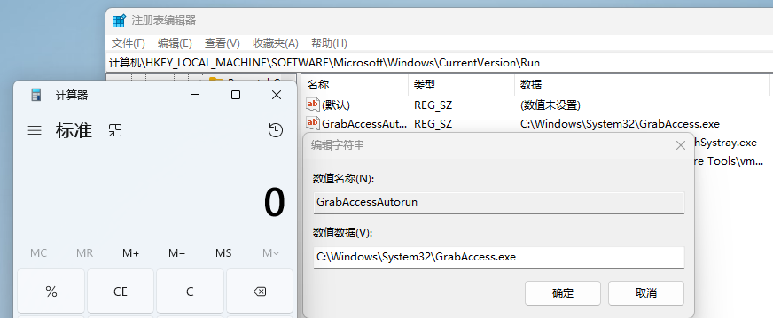

# GrabAccess

**Bootkit / Windows登陆密码绕过工具**

------

[**中文**](https://github.com/Push3AX/GrabAccess/blob/main/readme_cn.md) | [English](https://github.com/Push3AX/GrabAccess/blob/main/readme.md)

在物理接触的情况下，GrabAccess可以：

1. 绕过受支持的Windows本地账号登录路径（本地账号 + 密码 / PIN / 图片密码）
2. 登陆方式无法绕过时，提供无需登录的文件管理、账户管理等功能
3. 自动化植入指定的程序并添加自启动
4. 通过修改主板UEFI固件实现无视重装系统、更换硬盘的持久化（Bootkit）

但GrabAccess不支持绕过Secure Boot、MBR引导方式、32位操作系统。

------

## 快速开始

GrabAccess最基础的功能是绕过Windows登录密码。

1. 准备一个U盘。（需为`FAT16`或`FAT32`格式）

2. 下载[GrabAccess_Release.zip](https://github.com/Push3AX/GrabAccess/releases/download/Version1.2/GrabAccess_Release_1.2.0.zip)，解压到U盘根目录。

3. 将U盘插入目标计算机。重启，在启动时进入BIOS菜单，选择从U盘启动（若开启了`Secure Boot`，还需将其关闭）。

4. 若成功绕过登录认证，在启动过程中会弹出提示信息，稍后在Windows登录界面输入任意密码即可登录。

5. 若未能绕过登录认证，则在启动过程中会弹出提示窗口，可以进行文件管理、账户管理，或以System权限执行任意命令。

------

## 自动化植入

GrabAccess可以自动植入指定的程序，并为其添加启动项。

要使用该功能，需要预先将GrabAccess与要植入的程序打包：

1. 下载[GrabAccess_Release.zip](https://github.com/Push3AX/GrabAccess/releases/download/Version1.2/GrabAccess_Release_1.2.0.zip)，解压并放置在U盘根目录。

2. 将需要植入的程序命名为`payload.exe`，放置在U盘根目录。

3. 运行`powershell -ExecutionPolicy Bypass -File .\build.ps1`进行打包。

4. 将U盘插入目标计算机、从U盘启动。

5. Windows启动后，指定的程序将被添加到启动项并运行。

------

## 修改主板UEFI固件实现Bootkit

GrabAccess可以被植入到计算机主板的UEFI固件。实现硬件级别的持久化（Bootkit）。

每次Windows系统启动时，GrabAccess会植入指定的程序，即使重装系统或更换硬盘之后也会重新植入。要移除它，只能刷写主板固件或更换主板。

**警告：以下操作可能损坏主板！必须对UEFI固件有一定了解才可继续。AT YOUR OWN RISK !!!!**

要实现这一功能，大致分为四步：

1. 将GrabAccess与要植入的程序打包
2. 提取主板UEFI固件
3. 向UEFI固件插入GrabAccessDXE
4. 将固件刷回主板

不同主板的第2和第4步有较大不同。部分主板可以通过软件方式刷新固件，但也有部分主板存在校验，只能使用编程器刷新。因差异众多，在此不深入讨论，读者可以自行在网上搜索某型号主板对应的方式。

将GrabAccess与要植入的程序打包的方式与前文相同，即：将需要植入的程序命名为payload.exe，放置在GrabAccess的根目录，运行`powershell -ExecutionPolicy Bypass -File .\build.ps1`进行打包。结束后得到`native.exe`，稍后将会用到。

在提取到主板UEFI固件后，使用[UEFITool](https://github.com/LongSoft/UEFITool)打开，按下`Ctrl+F`，选择`Text`，搜索`pcibus`，在下方双击搜索到的第一项。

在`pcibus`这一项上右键，选择`Insert before`，然后选取[GrabAccess_Release.zip](https://github.com/Push3AX/GrabAccess/releases/download/Version1.2/GrabAccess_Release_1.2.0.zip)中`UEFI_FSS`文件夹的`GrabAccessDXE.ffs`。

插入`GrabAccessDXE`后，在`GrabAccessDXE`上右键，选择`Insert before`，插入`UEFI_FSS`文件夹的`native.ffs`。此时应该如下所示：

双击展开`native.ffs`（它没有名字，但GUID是`2136252F-5F7C-486D-B89F-545EC42AD45C`），在`Raw section`上右键，选择`Replace body`，然后选取前文中生成的`native.exe`进行替换。

最后，点击File菜单的`Save image file`，保存固件到文件。

这份固件已经成功植入了Bootkit，将其刷回主板。如果一切顺利，在每一次Windows启动过程中，`native.exe`都会被写入并执行。

如果没有成功，可以尝试以下操作：

1. 关闭UEFI设置中的`Secure Boot`和`CSM`，确定操作系统是通过UEFI模式加载的。
2. 向固件插入`UEFI_FSS`文件夹下的`pcddxe.ffs`（方法同前文。但注意，这个模块可能会与其它模块冲突造成不能开机，仅建议在使用编程器的情况下尝试！）

------

## 原理解析

### Windows Platform Binary Table

和Kon-boot篡改Windows内核不同，GrabAccess的工作原理，源自于Windows的一项合法后门：WPBT（Windows Platform Binary Table）。

WPBT常用于计算机制造商植入驱动管理软件、防丢软件。类似Bootkit病毒，一旦主板中存在WPBT条目，无论是重装系统还是更换硬盘，只要使用Windows系统，开机后都会被安装指定程序。

WPBT的原始设计，应当是由生产商在主板的UEFI固件中插入一个特定的模块实现。但是，通过劫持UEFI的引导过程，攻击者可以插入WPBT条目，而无需修改主板固件。

### GrabAccess做了什么

GrabAccess包含三个阶段。

Stage1是一个UEFI应用程序（或者UEFI DXE驱动），用于在UEFI环境下向ACPI表写入WPBT条目。U盘版本会读取启动分区中的`native.exe`，写入WPBT后继续启动Windows Boot Manager；固件植入版本则会从固件volume中读取内嵌的`native.exe`，从而在每次启动时重新触发WPBT流程。

Stage2是一个Windows Native Application，在Windows登录前由WPBT执行。WPBT只能加载NativeApp，此时系统还没有进入完整的Win32环境。其负责读取自身末尾的打包信息，根据内容决定进入哪一种模式。

若为自定义payload模式，则将用户指定的payload释放到`C:\Windows\System32\GrabAccess.exe`，并写入`HKLM\SOFTWARE\Microsoft\Windows\CurrentVersion\Run\GrabAccessAutorun`启动项。

若没有自定义payload，Stage2会将Stage3的各组件`Injector.exe`、`GrabAccessMsvpBypass.dll`、`GrabAccessExplorerHost.exe`和`GrabAccessFallback.exe`，写入`C:\Windows\System32`。然后IFEO劫持LogonUI，在启动过程中执行GrabAccess辅助脚本。

当登陆方式为本地账号 + 密码 / PIN / 图片密码时，Stage2使用`Injector.exe`将`GrabAccessMsvpBypass.dll`注入`lsass.exe`。此DLL会 hook `NtlmShared!MsvpPasswordValidate`，让密码校验函数无条件返回成功，实现输入任意密码即可登录。

当登陆方式为Microsoft在线账号、Entra ID/Azure AD、域账号，或开启了RunAsPPL/protected LSASS等无法绕过的情况时，Stage2会启动`GrabAccessFallback.exe`，提供三个入口：文件管理、命令行、账户管理。文件管理器为`GrabAccessExplorerHost.exe`，命令行入口会打开SYSTEM权限的`cmd.exe`，账户管理入口会打开`netplwiz.exe`。

------

## Credits

1. [Windows Platform Binary Table (WPBT) ](https://download.microsoft.com/download/8/a/2/8a2fb72d-9b96-4e2d-a559-4a27cf905a80/windows-platform-binary-table.docx)
2. [WPBT-Builder ](https://github.com/tandasat/WPBT-Builder)
3. [Windows Native App by Fox](http://fox28813018.blogspot.com/2019/05/windows-platform-binary-table-wpbt-wpbt.html)
4. [Nefarius Injector](https://github.com/nefarius/Injector)

------

## 404星链计划

GrabAccess 现已加入 [404星链计划](https://github.com/knownsec/404StarLink).
